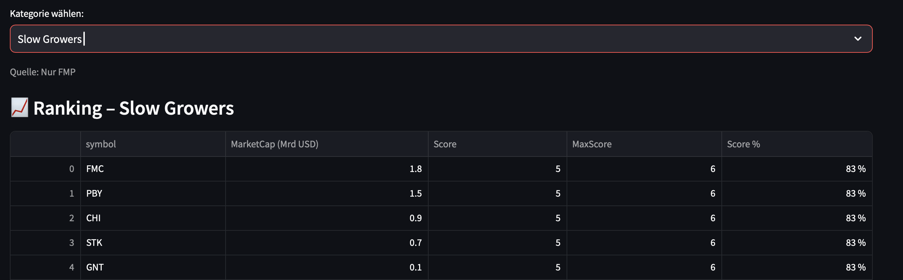

# Automatisierte Aktienanalyse nach Peter Lynch (Praxisprojekt)

---

## Inhaltsverzeichnis
- [1. Einleitung](#1-einleitung)
- [2. Bezug zum WI-Projekt](#2-bezug-zum-wi-projekt)
- [3. Theoretische Grundlage – Kurzüberblick](#3-theoretische-grundlage--kurzüberblick)
- [4. Systemarchitektur](#4-systemarchitektur)
- [5. Datenquellen und API-Abruf](#5-datenquellen-und-api-abruf)
- [6. Datenmodell und Elasticsearch-Mapping](#6-datenmodell-und-elasticsearch-mapping)
- [7. Streamlit-Dashboard](#7-streamlit-dashboard)
- [8. Setup & Deployment](#8-setup--deployment)
- [9. Geplante Erweiterungen](#9-geplante-erweiterungen)
- [10. Fazit](#10-fazit)
- [11. Quellen](#11-quellen)

---

## 1. Einleitung

### 1.1 Motivation  
Öffentlich verfügbare Finanzdaten werden häufig nur manuell ausgewertet oder in unstrukturierten Formaten bereitgestellt.  
Dieses Praxisprojekt verfolgt das Ziel, fundamentale Unternehmensdaten automatisiert zu verarbeiten, zentral zu speichern und anhand eines strukturierten Bewertungsmodells – basierend auf der Investmentstrategie von Peter Lynch – visuell analysierbar zu machen.

### 1.2 Projektziel  
Ziel ist der Aufbau einer durchgängigen Datenpipeline, die:

1. Kennzahlen zu allen Aktien die mal einer der S&P-500-Aktien sind/wahren automatisiert über APIs abruft  
2. Sie in Elasticsearch strukturiert speichert  
3. Sie anhand der 6 Lynch-Kategorien klassifiziert  
4. Über ein Streamlit-Dashboard filter-, vergleich- und visualisierbar macht  
5. Grundlage für tägliche Updates, Alerts, Backtesting und ML-Erweiterungen bildet  


## 2. Bezug zum WI-Projekt

Dieses Praxisprojekt baut auf dem vorherigen WI-Projekt auf, in dem die **theoretische Grundlage** zu Peter Lynch detailliert dokumentiert wurde (inkl. Kennzahlen, Zielwerte, Quellen und API-Endpunkte).

| WI-Projekt (Theorie) | Praxisprojekt (Technik) |
|----------------------|--------------------------|
| Lynch-Kategorien erklärt | Kategorien werden automatisch berechnet |
| Tabellen mit Kennzahlen | API-Daten werden geladen & gespeichert |
| Zielwerte definiert | Bewertung erfolgt algorithmisch |
| Dokumentation in Textform | Analyse & UI über Dashboard |

➡️ Vollständige Theorie befindet sich in der WI-Projektdokumentation.  
➡️ Diese README enthält **nur eine kompakte Zusammenfassung**.

---

## 3. Theoretische Grundlage – Kurzüberblick

| Kategorie | Typische Unternehmen | Kerneigenschaft |
|-----------|---------------------|-----------------|
| Slow Growers | Versorger, alte Industrien | Niedriges Wachstum, stabile Dividenden |
| Stalwarts | Markenriesen (z. B. Coca-Cola) | 5–10 % Gewinnwachstum |
| Fast Growers | Wachstumsunternehmen | > 20 % Gewinnwachstum |
| Cyclicals | Auto, Stahl, Airlines | Schwanken mit Konjunktur |
| Turnarounds | Sanierungskandidaten | Rückkehr zur Profitabilität |
| Asset Plays | Versteckte Werte | Buchwert > Marktwert |

Nur die technische Umsetzung erfolgt hier.  
Die vollständige Theorie → siehe WI-Projekt.

---

## 4. Systemarchitektur

### 4.1 Architekturübersicht

| Komponente | Aufgabe |
|------------|---------|
| **Python** | Datenabruf, Transformation, ETL-Pipeline |
| **Elasticsearch** | Speicherung & indexbasiertes Querying |
| **Docker Compose** | Infrastruktur-Orchestrierung |
| **Streamlit** | Web-Frontend für Analyse |
| **APIs** | FMP, yfinance, Alpha Vantage |

### 4.2 Architekturdiagramm

            ┌────────────────────────────┐
            │  Datenquellen (APIs)       │
            │  FMP / yfinance / AV       │
            └────────────┬───────────────┘
                         │ JSON-Response
                         ▼
                ┌──────────────┐
                │  Python ETL  │
                │ (load_data)  │
                └──────┬───────┘
                       │ transformed data
                       ▼
            ┌────────────────────────┐
            │   Elasticsearch Index  │
            │   (stocks, metrics)    │
            └─────────┬──────────────┘
                      │ query
                      ▼
            ┌────────────────────────┐
            │   Streamlit Dashboard  │
            │   Charts, Filter, UI   │
            └────────────────────────┘

---

## 5. Datenquellen & API-Abruf

Dieser Abschnitt beschreibt, **woher** die Daten stammen und **wie** sie technisch in das System geladen werden – noch ohne Bezug auf das Elasticsearch-Datenmodell.

| Quelle | Skript | Typische Felder (roh) | API-Endpunkt / Methode |
|--------|--------|------------------------|------------------------|
| FMP (FinancialModelingPrep) | `ingest_fmp.py` | `peRatio`, `priceToBook`, `marketCap`, `dividendYield` | `/api/v3/quote/{symbol}` |
| yfinance | `ingest_yf.py` | `trailingPE`, `freeCashFlow`, `beta`, `sharesOutstanding` | `Ticker.info`, `balance_sheet`, `cashflow` |
| Alpha Vantage | `Ingest_AV.py` | EPS-Historie, SG&A-Daten | `EARNINGS`, `INCOME_STATEMENT` |
| FMP JSON-Batch (offline) | `ingest_fmp_sp.py` | kompletter Fundamentaldatenblock | lokale JSON-Dateien |

➡️ In diesem Abschnitt keine Feldtypen, kein Mapping, keine Normalisierung.

### 5.2 Beispiel-Response (FMP)

    {
    "symbol": "AAPL",
    "peRatioTTM": 28.31,
    "revenuePerShareTTM": 24.52,
    "dividendYieldTTM": 0.0059
    }

## 6. Datenmodell und Elasticsearch-Mapping
    Dieser Abschnitt beschreibt, wie die eingehenden Daten anschließend strukturiert und vereinheitlicht im Elasticsearch-Index gespeichert werden.  
    Indexname: stocks   
    Dokument-ID: SYMBOL |YYYY-MM-DD|  (z. B. AAPL|2025-11-06)

### 6.1 Einheitliche Zielfelder im Index
| Zielfeld         | Typ     | Herkunft / Fallback                      |
| ---------------- | ------- | ---------------------------------------- |
| `peRatio`        | double  | FMP.peRatio → yfinance.trailingPE        |
| `earningsGrowth` | double  | berechnet aus Historie                   |
| `revenueGrowth`  | double  | YoY Ableitung                            |
| `debtToAssets`   | double  | totalDebt / totalAssets                  |
| `fcfMargin`      | double  | freeCashFlow / revenue                   |
| `sgaTrend`       | boolean | berechnet aus SG&A-Quote (Alpha Vantage) |
..


### 6.2  Beispiel-Mapping (JSON)
    {
    "mappings": {
        "properties": {
        "symbol":       {"type": "keyword"},
        "date":         {"type": "date"},
        "source":       {"type": "keyword"},
        "ingested_at":  {"type": "date"},

        "peRatio":      {"type": "double"},
        "priceToBook":  {"type": "double"},
        "dividendYield":{"type": "double"},
  
        ..
    }
    }
    }
### 6.3 Beispiel-Dokument in Elasticsearch

    {
    "_id": "AAPL|2025-11-06",
    "_source": {
        "symbol": "AAPL",
        "date": "2025-11-06",
        "source": "FMP",
        "ingested_at": "2025-11-06T12:34:56Z",

        "peRatio": 28.3,
        "priceToBook": 39.2,
        "dividendYield": 0.0059,
        "marketCap": 2.9e12,

        "earningsGrowth": 0.12,
        "revenueGrowth": 0.08,
        "fcfMargin": 0.24,
        "debtToAssets": 0.31,
        "beta": 1.18,
        "sgaTrend": true
    }
    }


➡️ Ab hier sind die Daten bereit für Klassifikation, Score & Dashboard.

## 7. Streamlit-Dashboard

Das Streamlit-Dashboard besteht aus drei Pages, die gemeinsam die Analyse-, Screening- und Portfolio-Funktionen bereitstellen.  
Alle Daten werden live aus Elasticsearch geladen und basieren auf den zuvor ingestierten API-Daten (FMP, yfinance, Alpha Vantage).

### 7.1 Funktionen

- **Dashboard (Einzelanalyse):**  
  - Suche nach Ticker  
  - KPI-Panel (KGV, EPS, FCF, Div. Yield, Debt/Equity etc.)  
  - Automatische Peter-Lynch-Kategorisierung inkl. Begründung  
  - Interaktive Zeitreihen-Charts (KGV, Wachstum, P/B, FCF etc.)  
  - Glossar & KPI-Erklärungen  
  [Link zur Dashboard-Page](http://localhost:8501/Dashboard)

- **Top-10 (Screening & Ranking):**  
  - Ranking je Peter-Lynch-Kategorie (z. B. „Fast Growers“, „Stalwarts“)  
  - Branchen- & Marktkapitalisierungs-Filter  
  - Scoring-Logik mit Trefferquote pro Kriterium  
  - Detailansicht pro Aktie: „Kriterium erfüllt / nicht erfüllt“   
    [Link zur Top-10 Page](http://localhost:8501/Top_10) 

- **Portfolio (Builder & Verwaltung):**  
  - Auswahl & Gewichtung von Aktien je Kategorie  
  - Strategie-Presets (z. B. defensiv, wachstumsorientiert etc.)  
  - Vergleich Soll- vs. Ist-Gewichtung (inkl. Diagramm)  
  - Speicherung & Laden von Portfolios in Elasticsearch  
    [Link zur Portfolio-Page](https://mein-dashboard.de/Portfolio)

---


### 7.2 Ranking-Logik (Scoring nach Peter Lynch)

Die Bewertung einer Aktie erfolgt anhand eines regelbasierten Scoring-Systems, das pro Lynch-Kategorie unterschiedliche Kennzahlen prüft.  
Die Regeln sind zentral in `lynch_criteria.py` definiert und legen fest:

- **welche Kennzahlen relevant sind** (z. B. KGV, EPS-Wachstum, Schuldenquote)
- **ob ein Kriterium verpflichtend oder optional ist**
- **welcher Zielbereich als „gut“ gilt** (z. B. KGV < 15)

#### Beispiel: Kategorie „Fast Grower“

| Kriterium | Zielwert | Pflicht? |
|-----------|----------|----------|
| EPS-Wachstum 5y > 20 % | ✅ | ja |
| Umsatzwachstum > 10 % | ✅ | ja |
| KGV < 35 | ✅ | optional |
| Verschuldung < 50 % | ✅ | optional |
..
#### Berechnung des Scores
1. Jede Aktie wird mit allen Kriterien der gewählten Kategorie verglichen  
2. Erfüllte Pflicht-Kriterien → **+1 Punkt**  
3. Erfüllte optionale Kriterien  → **+1 Punkte**  
4. Score = erreichte Punkte / maximal mögliche Punkte  
5. Bei gleichem Score erfolgt die Sekundärsortierung automatisch nach Marktkapitalisierung (absteigend), um größere und damit tendenziell stabilere Unternehmen zu bevorzugen, denn sie sind stabiler am Markt.   
[Link zur Quelle, die Punkt 5 befürwortet.](https://www.sciencedirect.com/science/article/pii/S1094202524000437)

### Beispiel:


## 8. Setup & Deployment

### 8.1 Voraussetzungen
- Docker & Docker Compose  
- Python **3.10+**  
- API-Keys in einer `.env`-Datei

    Beispiel `.env`:
    ```env
    FMP_API_KEY=dein_fmp_key
    ALPHA_VANTAGE_KEY=dein_alpha_vantage_key
    ELASTICSEARCH_URL=http://localhost:9200

    8.2 Startreihenfolge
    Container starten
    docker compose up -d
    Daten laden (S&P 500)
    python load_sp500.py
    Dashboard starten
    streamlit run dashboard.py
    Tipp: Prüfe http://localhost:8501 (Streamlit) und http://localhost:9200 (Elasticsearch).

---

## 9. Geplante Erweiterungen
 Mehr Aktien    
 Mehr Cronjob zu jede API


## ....

## 10. Fazit
### Projektübersicht: Automatisierter Analyse-Workflow 

Das Projekt zeigt, dass sich ein vollständiger, automatisierter Analyse-Workflow für Fundamentaldaten mit vertretbarem Aufwand realisieren lässt:

### Kernfunktionen
- **Automatisierte Datenerfassung** über mehrere APIs (FMP, yfinance, Alpha Vantage)  
- **Zentrale & strukturierte Speicherung** in Elasticsearch  
- **Regelbasiertes Bewertungssystem nach Peter Lynch** (inkl. Scoring & Ranking)  
- **Interaktives Streamlit-Dashboard** für Analyse, Screening & Portfolio-Management  

###  Demonstrierter Mehrwert
- API-gestütztes **Data Engineering**
- Nutzung einer **Suchindex-Datenbank statt klassischer SQL-Modelle**
- **Nachvollziehbares Regelwerk** statt Blackbox-ML
- **Modulare, wiederverwendbare ETL-Pipelines**
- **Automatisierte Workflows** als Grundlage für spätere Skalierung

###  Erweiterbarkeit (bewusst vorgesehen)
- **Technisch**: zusätzliche Datenquellen, Backtesting, Alerts, Scheduling
- **Funktional**: ML-Modelle, internationale Märkte, Portfolio-Tracking, weitere Bewertungsmodelle

---

### Kurzfassung
Aus einem **theoretischen Bewertungsmodell** wurde ein **lauffähiges, erweiterbares Analyse-System**,  
das echte Investmententscheidungen unterstützen kann.


## 11. Quellen
https://www.sciencedirect.com/science/article/pii/S1094202524000437


---


